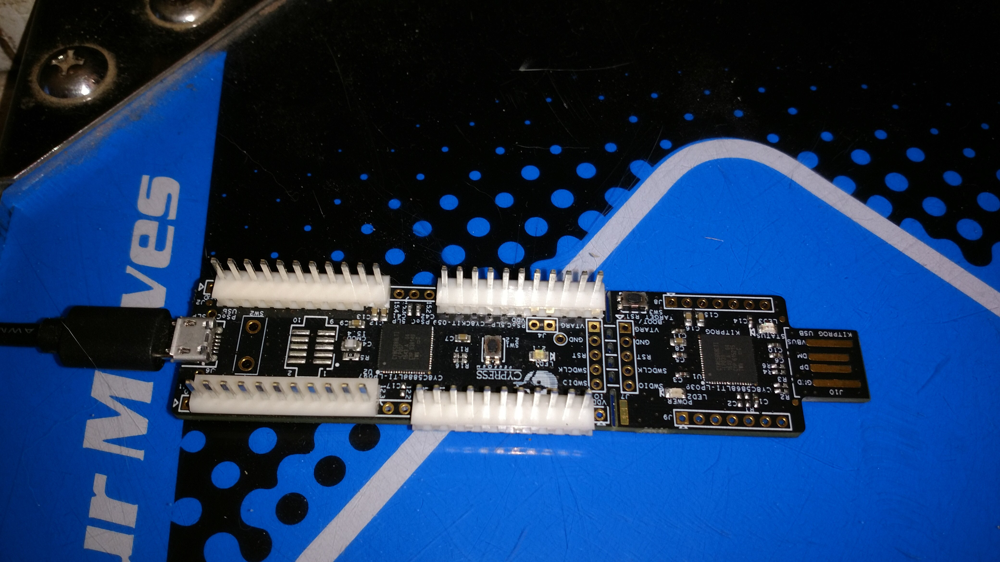
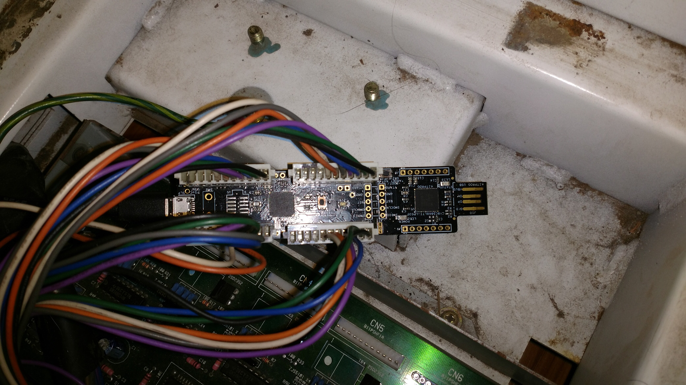

# GHETT-iO Input/Output board

## Description
The GHETT-iO ("Ghetto IO") board is the easiest way to get input from a dance pad to a computer.  It is based on the [CY8CKIT-059][] PSoC prototyping kit.

## Philosophy
There are a variety of I/O solutions available for dance machines, however, it
can be difficult (and expensive) to replace failed parts.  Many of the boards are
designed to work only in an arcade cabinet; they rely upon external power supplies to
function.

The Cypress PSoC 5LP is a modern microcontroller with Full-Speed USB support, 
programmable logic capabilities, and a fast clock speed.  It's ARM-based, and has
a free manufacturer-supported toolchain [PSoC Creator][] available to download.

The company that produces the PSoC line of chips, [Cypress Semiconductor][] has made
available a $10 prototyping kit.  This kit includes a detachable programmer, and 
approximately 44 usable I/O pins (depending on configuration).  As the PSoC contains
internal input protection (diode clamps), as well as configurable pull-ups and pull-
downs, it is possible to handle all of the IO required for a standard DDR pad with
a single chip.

To assemble a GHETT-iO, one need only the kit from Cypress, reasonable soldering
equipment and skills, and the appropriate headers (if any).  The use of the standard
0.1 inch pitch and a DIP-style layout ensures that the board is directly compatible
with both breadboards and the DDR connectors.

The GHETT-iO is easy to assemble, and open source.  This should help ensure avail-
ability for the foreseeable future.

## Photos

[CY8CKIT-059]: http://www.cypress.com/documentation/development-kitsboards/cy8ckit-059-psoc-5lp-prototyping-kit-onboard-programmer-and