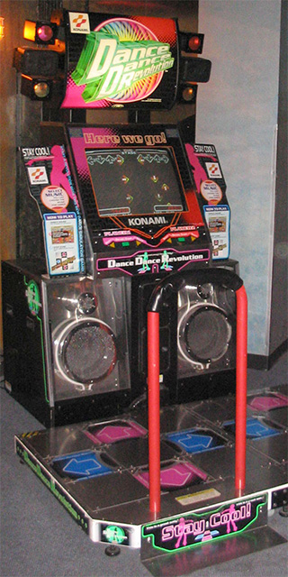
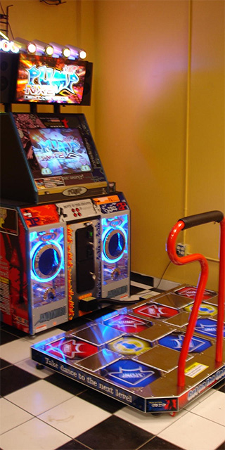
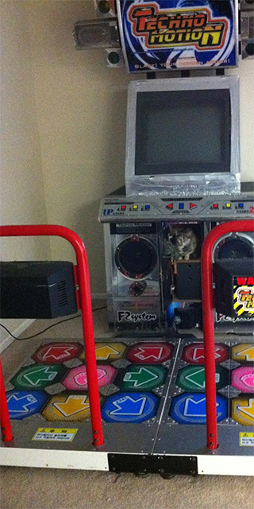
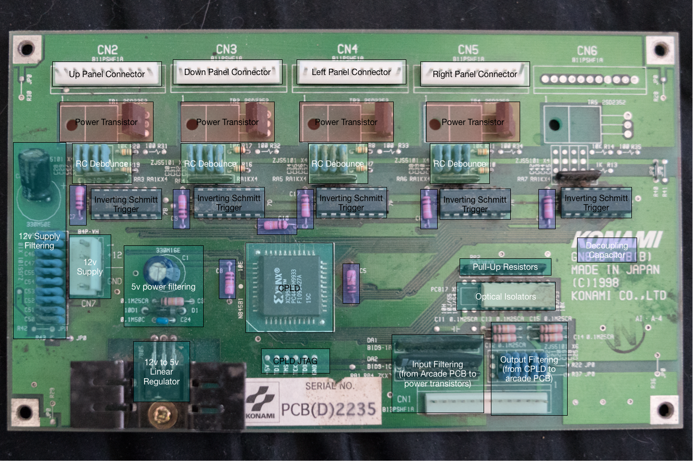
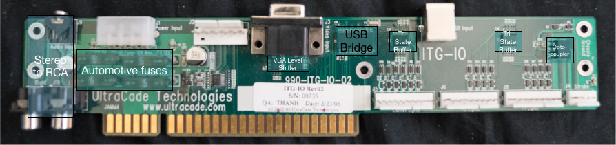

# Technomotion IO Emulator

## Description
Dancing stage games are a popular form of entertainment in Japan, and in the United States.  This board provides I/O functionality for a simulated arcade environment.

## Background
### Hardware
Machines generally fall into three categories - four, five, and eight panel.

#### 4 Panel Machines (e.g. Dance Dance Revolution, In The Groove)

These games feature four arrows - Up,Down,Left,Right.  The center panel is usually non-functional, and is used as a place to stand.

#### 5 Panel Machines (e.g. Pump It Up)

Pump it up features 5 dance panels - a center panel and the 4 corners.  The center panel is functional, and players stand between the arrows when resting.

#### 8 Panel Machines (e.g. Technomotion)

TechnoMotion features a 9 panel stage, but lacks a 9 panel mode.  Instead, the game can be switched between 4 panel, 5 panel, and 8 panel (all panels except for the center), even while the game is playing.

### Emulation
Arcade machines (while new) typically cost $10,000 USD or more. They are difficult for people to use in their home due to the size and the weight.

StepMania is an open-source reimplementation of dancing stage games for home computers.  It features a flexible LUA-based scripting and theme engine, as well as support for emulation of the most popular play formats.

In general, dancing stage games follow a standard format.  A series of arrows is displayed on the screen, typically scrolling from bottom to top.  At the top of the screen a set of matching arrows are visible, and when the arrow at the top matches the arrow in the move list, the player is supposed to press the corresponding arrow.  Players receive points for proper presses, depending on how accurately their timing is.  Extra steps are generally not penalized.

### Hardware

#### Konami (Dance Dance Revolution)

Any discussion of Dancing games would be remiss if it did not start with Konami, the company largely responsible for the creation of the genre.

Konami is a Japanese entertainment company, and their Dance Dance Revolution game is highly influenced by the culture and environment which birthed it.  The game capitalized on the popularity of the J-Pop genre, as well as the popularity of English in Japan, leading to a game in which the text is mostly Japanese, but the dialog is all in English.  Songs are a fusion of Japanese and American songs, helping lead to the popularity of Japanese arcade machines in the US.

Being a Japanese game company, they developed for the popular systems of the time.  Working closely with Sony, they were able to adapt the processor from the popular PlayStation console to a custom PCB.  This allowed them to use largely the same game for home use and Arcade machines.  By producing a generic "playstation arcade version", they were able to keep the hardware largely the same (the System 573 platform), while producing I/O boards that could be used for different purposes.  Later versions of the arcade platform would simply put a Playstation 2 in an enclosure.

As a Japanese company, they tended to follow Japanese standards.  Their arcade machines follow the JAMMA (Japan Amusement Machine and Marketing Association) standards, and the Dance Dance Revolution machines are no exception.  JAMMA connectors are designed to permit arcade PCBs to easily move from one machine to another, and while the unique needs of the DDR machines (lights and cabinet outputs) necessitate additional connectors that make moving the PCB impossible, they still chose to follow the standard.

As is typical for arcade machines, JAMMA compliant power supplies feature +12v, +5v, and -5v rails.  +5v was chosen due to the use of CMOS logic signal voltage levels, and -5v is used in a few machines to drive op amps (generally for audio).  12v is used to drive lights, fans, etc., and reduces the line losses for the same wattage.

Inputs are active-low, which simplifies the handling and debouncing of inputs.  The input is brought high with the use of a pull-up resistor, and the normally open input is connected to ground.  A capacitor is used to keep the input high for a period of time after the switch is connected, and a Schmitt trigger serves to provide hysteris, leading to a very clean output.  Inverting Schmitt triggers are generally used to provide an active-high input to microcontrollers.

Konami's design emphasized component reuse, and low EMI.  As such, they used a large number of 3 terminal EMI filters (ZJS5101), which combine the functions of both capacitors and inductors, providing an effective low-pass filter to reduce harmful RF interference.  The use of a linear voltage regulator, while less efficient, also served to avoid high speed switching noise.  Being a Japanese company, JST connectors were used.

The CPLD used (XC9536) provided for high-speed input handling.  Each panel contains 4 pressure-sensitive sensors, which are fed to Hex Schmitt Inverters.  The output from this is fed into the XC9536, which combines the inputs from each panel into a single output which is fed to the JAMMA harness.  Additionally, for testing, the CPLD can be placed into a mode where each sensor is individually addressable (to determine if sensors are stuck or failing to fire), and accessed via low speed RS232.  The use of the CPLD enables response times of several milliseconds, important for timing in rhythm-based games.  

Each panel has four inputs (one for each sensor), and an output (used to light the panel).  The IO board is designed to be extensible, and features support for an additional fifth input.  The output is driven using an NPN power transitor to switch the 12v supply.  

Signals from the stage PCB to the arcade PCB are optically isolated, cleaned up with a capacitor, and an EMI filter.  EMI coming from the system PCB to the stage PCB is less of an issue, and power surges more so.  As such, signals coming from the stage PCB are connected to two diode arrays (positive and negative) that serve as voltage clamps, protecting the NPN power transistor from voltages that exceed it's specifications by clamping them.

The board is responsible for its own conversion from 12v to 5v.  Although the system power supply is capable of producing a 5v supply, and linear voltage regulators are rather inefficient at this range, it provides a very clean and responsive supply.  Four separate capacitors are used (at different values) in order to ensure a very high speed response to power fluctuation.

#### Andamiro (Pump It Up)
As DDR was intended for use in JAMMA-Compatible arcades, as well as for the PlayStation, the game was largely limited to 4 direction inputs.  As such, Konami's design patents also extended to 4 directional inputs.

Pump It Up was built as a 5 panel game in part to get around the design patents.  By using diagonal arrows, and a center panel, they were able to avoid patent infringement.

#### Roxor Games (In The Groove)
Around 2004, Roxor Games came out with In The Groove, a game designed to adress the stagnation in the dance game marketplace.  Roxor contacted the authors of the open-source StepMania game, and were able to get it relicensed.  They partnered with Andamiro to produce a line of arcade cabinets that featured StepMania in a 4 panel configuration, with new songs and features.

Additionally, they produced a line of upgrade kits for existing Dance Dance Revolution arcade machines.  This led to a lawsuit for infringement of design patents that ultimately bankrupted them and led to a settlement in which Konami received all rights to the In The Groove intellectual property.

The ITG-IO, unlike the hardware produced by Konami is designed to be cheap.  By using commodity desktop computers, they were able to position themselves as a very low cost upgrade.  RF emissions were high, and the lack of a common ground between the PC and the arcade power supply would often lead to problems, but for arcade owners facing dwindling returns on their hardware, it was a cost-effective solution.

Roxor partnered with UltraCade Technologies to produce an IO board that permitted the adaptation of standard PCs to arcade machines.  It features a single optically-isolated output (to drive the neon lights), and the smallest possible number of inputs required.  As such, it ignores the second coin counter, coin lock functionality, buttons 1 and 4 of player input, etc.  Service and Test are combined into a single input.  Only VGA is supported, as the translation is more straightforward - 0.7v PC levels are amplified to 5v arcade levels, and the ITG-IO combines the separate RGB component sync signals into a single composite sync (as required by the JAMMA specification).

The ITG-IO does low-side switching, tristating the outputs with field effect transistors.  It features two USB endpoints, and it's low number of inputs and outputs allows packets to be 2 bytes in length.

Audio is handled by a simple passthrough 1/8 inch stereo to RCA adapter, intended for use with the DDR cabinet's audio amplifier.  Inputs come from the JAMMA connector, and outputs go to dedicated output connectors.

## Board Purpose

There are plenty of hardware solutions at present for getting four panel input to PC.  PS2 dance pads are widely available, along with a plethora of PS2 to USB adapters.  There are even a few options for output control, with devices like the Minimaid making it possible to replicate the functionality of the ITG-IO in placing a standard PC into a standard DDR cabinet.

Additionally, there are solutions out there for 5 and 8 (or 9) panel inputs.  Precision Dance Pads manufacturers dance pads in 4, 5, 6, or 9 panel configurations.

Unfortunately, where these solutions tend to fall short is outputs.  If someone wishes to build their own arcade machine, they are limited in the number of outputs they can have, and their ability to drive the lights on a cabinet, and in the pad.

The Technomotion IO emulater (Tek-IO) is designed to solve these issues.

## Theory of operation
Modern microcontrollers have significantly more analog IO functionality than previous generation chips.  The Cypress Programmable System on Chip (PSoC), for example, has the ability to do high-fidelity, adjustable PWM and software-defined debouncing.

Tek-IO is designed to handle all of the inputs and outputs necessary to construct any kind of dance control scheme.  It features the following benefits compared to existing solutions:

* Configurable analog I/O permits games (or players) to adjust the sensitivity
* Per-sensor configuration, permitting automatic adaptation to worn pads
* Automatic compensation for stuck or low-responsive pads
* Able to drive modern tricolor LEDs, permitting pads to change color depending on game mode or settings
* Permits the use of colored LEDs for cabinet lights and buttons
* Supports the use of multiple coin inputs (for example, a bill validator and a coin acceptor)
* Supports separate service, and courtesy credit input (useful for hardwired keyed momentary switches)
* Supports five buttons per player, allowing the use of DDR controls (left, right, start), DDR X (UDLR, Center), Technomotion (4 panel, 5 panel, 8 panel, Select, Start) and In The Groove (Left, Right, Up, Down).
* Programmable firmware permits the board to be reconfigured to different control schemes
* Implementation of the HID gamepad protocol enables easier integration
* A single board handles both stages, avoiding the need for separate power supplies
* Higher efficiency power supply reduces heat, and prolongs component life
* Ability to read individual sensors (using a propreitary interface)

Tek-IO presents itself to the operating system as a composite device with two separate 16-button joysticks, as well as offering USB endpoints for light control.  The use of two separate joysticks avoids issue with older versions of Linux experiencing memory corruption issues when using HID gamepads with more than 16 buttons.

## Inputs (Default configuration)
| Input               | Description                                                    | Input    |
| ------------------- | -------------------------------------------------------------- | -------- |
| P1 U, D, L, R       | Player 1 Pad Up, Down, Left, Right                             | J1 B1-4  |
| P1 UL, UR, LL, LR   | Player 1 Corners: UpperLeft, UpperRight, LowerLeft, LowerRight | J1 B5-8  |
| P1 Panel U, D, L, R | Player 1 Cabinet Up, Down, Left, Right                         | J1 B9-12 |
| P1 Center           | Player 1 Pad Center panel                                      | J1 B13   |
| P1 Panel Start      | Player 1 Cabinet Start Button                                  | J1 B14   |
| Coin 1              | First coin acceptor                                            | J1 B15   |
| Service             | Arcade machine service mode                                    | J1 B16   |
| P2 U, D, L, R       | Player 2 Pad Up, Down, Left, Right                             | J2 B1-4  |
| P2 UL, UR, LL, LR   | Player 2 Corners: UpperLeft, UpperRight, LowerLeft, LowerRight | J2 B5-8  |
| P2 Panel U, D, L, R | Player 2 Cabinet Up, Down, Left, Right                         | J2 B9-12 |
| P1 Center           | Player 1 Pad Center panel                                      | J1 B13   |
| P2 Panel Start      | Player 2 Cabinet Start Button                                  | J2 B14   |
| Coin 2              | First coin acceptor                                            | J2 B15   |
| Courtesy Credit     | Arcade machine courtesy credit                                 | J2 B16   |
